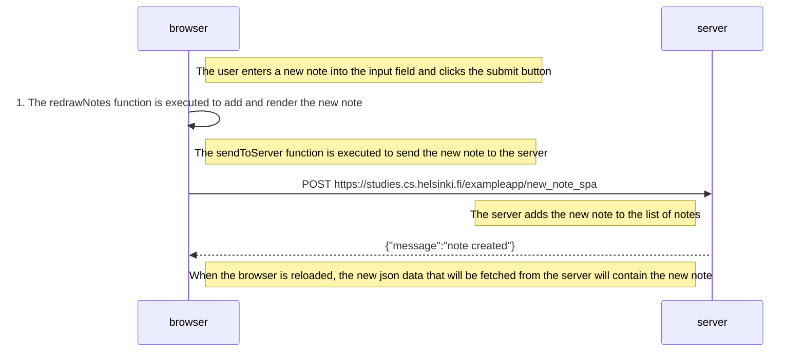

```mermaid
    sequenceDiagram
    participant browser
    participant server

    Note right of browser: The user enters a new note into the input field and clicks the submit button
    browser->>browser: 1. The redrawNotes function is executed to add and render the new note
    Note right of browser: The sendToServer function is executed to send the new note to the server
    browser->>server: POST https://studies.cs.helsinki.fi/exampleapp/new_note_spa
    activate server
    Note left of server: The server adds the new note to the list of notes

    server-->>browser: {"message":"note created"}

    
    Note right of browser: When the browser is reloaded, the new json data that will be fetched from the server will contain the new note
```