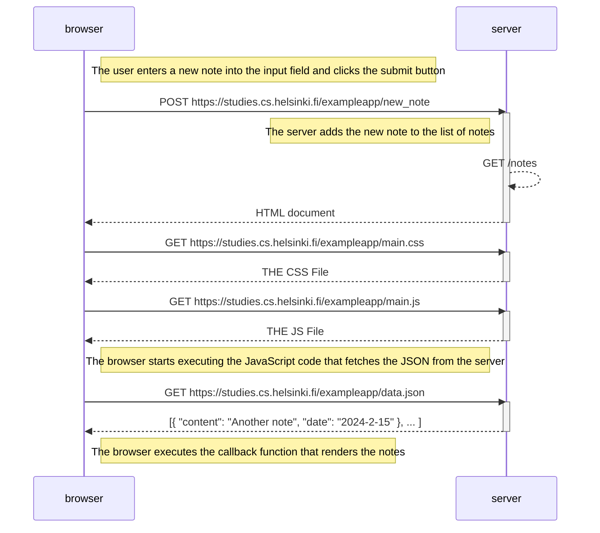

```mermaid
    sequenceDiagram
    participant browser
    participant server

    Note right of browser: The user enters a new note into the input field and clicks the submit button
    browser->>server: POST https://studies.cs.helsinki.fi/exampleapp/new_note
    activate server
    Note left of server: The server adds the new note to the list of notes
    server-->>server: GET /notes
    server-->>browser: HTML document
    deactivate server

    browser->>server: GET https://studies.cs.helsinki.fi/exampleapp/main.css
    activate server
    server-->>browser: THE CSS File
    deactivate server

    browser->>server: GET https://studies.cs.helsinki.fi/exampleapp/main.js
    activate server
    server-->>browser: THE JS File
    deactivate server

    Note right of browser: The browser starts executing the JavaScript code that fetches the JSON from the server

    browser->>server: GET https://studies.cs.helsinki.fi/exampleapp/data.json
    activate server
    server-->>browser: [{ "content": "Another note", "date": "2024-2-15" }, ... ]
    deactivate server

    Note right of browser: The browser executes the callback function that renders the notes
```